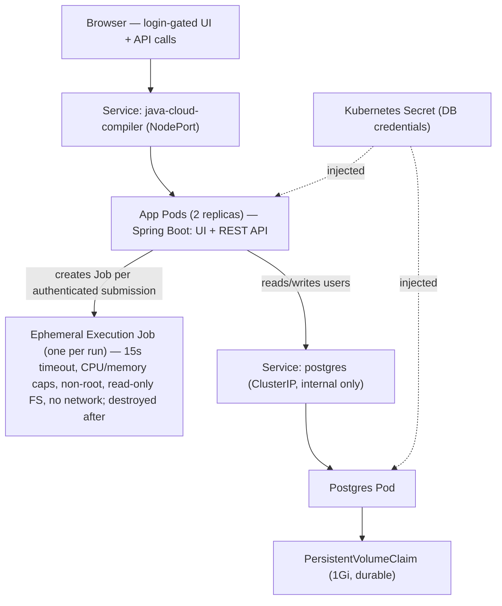

# Java Cloud Compiler

A containerized Java platform with a browser UI where **authenticated users
compile and run Java code**, and every submission executes inside its own
isolated, resource-limited, throwaway Kubernetes Job. It demonstrates backend
engineering (REST APIs, persistence, authentication, password security) and
infrastructure engineering (containerization, health probing, resource
management, self-healing, zero-downtime deploys, and safe execution of untrusted
code).

> **Status:** Complete and running on a local Kubernetes cluster (Minikube).
> Reliability platform, PostgreSQL integration, enforced session authentication,
> the sandboxed code-execution engine, a login-gated frontend, and one-command
> launchers for Windows and macOS/Linux are all in place. Remaining items are
> production-hardening steps — see [Known Limitations](#known-limitations) and
> [Roadmap](#roadmap).

---

## Quick Start

**Prerequisites:** Docker, Minikube, and kubectl installed, with Docker running.

- **Windows:** double-click **`start.bat`**
- **macOS / Linux:** `chmod +x start.sh` once, then **`./start.sh`**

Either launcher checks prerequisites, starts Minikube, creates the DB Secret,
builds and loads the image, applies all manifests, waits for readiness, and opens
the app in your browser. Keep the window open (it holds the tunnel). Tear down
with `stop.bat` / `./stop.sh` (the database volume and Secret are preserved).

The launchers are idempotent and fail with a clear message if a prerequisite is
missing. `start.bat` uses a one-time execution-policy bypass (no system settings
changed). If `start.sh` errors with `bad interpreter`, convert its line endings
to LF.

---

## Tech Stack

| Layer               | Technology                                        |
|---------------------|---------------------------------------------------|
| Language            | Java 21                                           |
| Framework           | Spring Boot 3.x                                    |
| Web                 | Spring Web (API) + static HTML/CSS/JS (UI)        |
| Persistence         | Spring Data JPA / Hibernate                       |
| Database            | PostgreSQL 16                                      |
| Connection Pool     | HikariCP                                           |
| Security            | Spring Security (BCrypt, enforced session auth)   |
| Observability       | Spring Boot Actuator                              |
| K8s Integration     | Fabric8 Kubernetes Java Client                    |
| Build               | Maven (multi-stage Docker build)                  |
| Orchestration       | Kubernetes (local via Minikube)                   |
| Code Execution      | Kubernetes Jobs (one ephemeral Job per run)       |

---

## Architecture



- **The application** is stateless: a 2-replica Deployment (serving both UI and
  API) behind a load-balancing Service.
- **The database** is a stateful workload with durable storage via a
  PersistentVolumeClaim.
- **Execution** happens in a fresh, locked-down Kubernetes Job per submission
  (only for authenticated requests), which is destroyed afterward.
- Credentials reach both the app and the database from a single Kubernetes Secret.

---

## Request Flows

**Login / signup (enforced).** Credentials are verified through Spring Security's
`AuthenticationManager` (which loads users via a `UserDetailsService` and checks
the BCrypt hash). On success the `Authentication` is placed in the SecurityContext
and persisted to the HTTP session, so later requests carrying the session cookie
are recognized as authenticated. `/api/auth/logout` clears it.

**Code execution (requires authentication).** An authenticated user submits Java
(public class must be named `Main`). The app writes it to a **ConfigMap**, creates
a **Job** that mounts the code read-only at `/code`, has a writable `emptyDir`
scratch dir at `/work`, and runs `javac -d /work /code/Main.java && java -cp /work
Main`. The app waits (bounded by a timeout), reads the pod's logs (compiler errors
or program output), truncates them, and **deletes the Job and ConfigMap**.

---

## Web Interface

A single self-contained `index.html` served from `src/main/resources/static/`,
with a **login/signup view** shown first and a **code-runner view** (editor + Run
+ output) revealed only after authentication, plus a logout button. All `fetch`
calls use `credentials: 'same-origin'` so the session cookie is carried; an
expired session (401/403) bounces the user back to login. Because Spring Boot
serves the page from the same origin as the API, no CORS setup is needed.

---

## Project Structure
```
.
├── start.bat / start.ps1 / stop.bat / stop.ps1   # Windows launcher + teardown
├── start.sh / stop.sh                             # macOS / Linux launcher + teardown
├── Dockerfile                                     # Multi-stage build
├── pom.xml
├── src/main/
│   ├── java/com/example/demo/
│   │   ├── DemoApplication.java        # Entry point
│   │   ├── HelloController.java        # /api/status
│   │   ├── User.java                   # JPA entity -> "users" table
│   │   ├── UserRepository.java         # Spring Data repository
│   │   ├── AppUserDetailsService.java  # Loads users for Spring Security
│   │   ├── AuthRequest.java            # DTO for signup/login
│   │   ├── AuthController.java          # Signup / login / session
│   │   ├── SecurityConfig.java         # Security rules, BCrypt, AuthManager, logout
│   │   ├── KubernetesConfig.java       # Fabric8 client bean
│   │   ├── ExecuteRequest.java         # DTO for code submissions
│   │   ├── ExecutionController.java    # /api/execute (protected)
│   │   └── ExecutionService.java       # Creates/monitors/cleans up exec Jobs
│   └── resources/
│       ├── application.yml
│       └── static/index.html           # Browser UI (login gate + editor)
└── k8s/
    ├── deployment.yaml                 # App Deployment (probes, limits, SA, secret env)
    ├── service.yaml                    # App Service (NodePort)
    ├── postgres-pvc.yaml
    ├── postgres-deployment.yaml        # Postgres (PVC, exec probes)
    ├── postgres-service.yaml           # ClusterIP, internal-only
    ├── executor-rbac.yaml              # ServiceAccount + Role + RoleBinding
    └── execution-networkpolicy.yaml    # Deny-all NetworkPolicy for exec pods
```

---

## Reliability & Infrastructure Features

**Health probes** (via Actuator, enforced by Kubernetes):
- **Liveness** (`/actuator/health/liveness`) — restart the container if it fails.
  Checks only the process, never external dependencies.
- **Readiness** (`/actuator/health/readiness`) — remove the pod from the
  load-balancer if it fails, *without* restarting. Actuator automatically ties
  this to database connectivity, so if Postgres is unreachable, readiness goes
  `DOWN` (traffic stops) while liveness stays `UP` (no pointless restart).
- **Startup** — holds off the other probes until the JVM has booted.

**Graceful shutdown** — on `SIGTERM` during a rolling update, the app finishes
in-flight requests before exiting (no dropped connections).

**Resource requests & limits** (app pods) — 250m/256Mi requested, 500m/512Mi
ceiling. Over-limit CPU is throttled; over-limit memory is `OOMKilled`.

**Self-healing** — the Deployment reconciles to 2 replicas; a deleted or crashed
pod is replaced automatically.

**Zero-downtime rolling updates** — a new pod must pass its readiness probe before
an old one is retired; combined with graceful shutdown, no request is dropped.
Versioned image tags allow `kubectl rollout undo` for instant rollback.

**Database as a stateful workload** — a PersistentVolumeClaim keeps data across
pod restarts; `strategy: Recreate` avoids two pods fighting over the single
volume; `exec` probes run `pg_isready` (the DB speaks its own protocol, not HTTP);
the ClusterIP Service is internal-only and gives a stable DNS name the app
connects by.

---

## Authentication & Security

Authentication is **enforced** — code execution requires a logged-in session.

- **Passwords are never stored in plain text** — hashed with **BCrypt** (a slow,
  adaptive hash with a built-in per-password salt), and only the hash is stored.
- **Login mechanism** — a `UserDetailsService` loads users; an
  `AuthenticationManager` verifies the password; the resulting authentication is
  placed in the SecurityContext and persisted to the session. `/api/execute` (and
  any non-public route) requires authentication; the page, `/api/status`,
  `/api/auth/**`, and `/actuator/**` are public.
- **Username enumeration protection** — login returns an identical error whether
  the username is unknown or the password is wrong.
- **Database-level uniqueness** — `username` is `UNIQUE NOT NULL`, so duplicates
  are rejected by the database itself.
- **Least-privilege execution** — the app acts under a dedicated ServiceAccount
  bound to a namespaced Role limited to Jobs/Pods/ConfigMaps, so a compromise
  can't take over the cluster.
- **Secrets stay out of the repo** — DB credentials live in a Kubernetes Secret
  created via CLI and injected as environment variables.

---

## The Code Execution Sandbox

Running untrusted code safely is the hard part. Each submission runs in an
isolated, disposable Kubernetes Job — never in the app process.

### Threat Model
Untrusted code can try to: (1) exhaust CPU (infinite loops), (2) exhaust memory,
(3) exhaust disk, (4) fork-bomb, (5) abuse the network, (6) read/write the
filesystem, (7) escape the container, (8) flood output.

### Defense in Depth
Independent layers, each mapping to a threat above:

| Control | Threat | Mechanism |
|---|---|---|
| `activeDeadlineSeconds: 15` (Job timeout) | 1 | Kubernetes kills the Job after 15s no matter what |
| App-side wait timeout (25s backstop) | 1 | Second timer if the first fails |
| Memory limit (256Mi) | 2 | Kernel OOM-kills the container |
| CPU limit (500m) | 1 | Container throttled |
| `emptyDir sizeLimit: 32Mi` | 3 | Caps the one writable directory |
| Read-only root filesystem | 3, 6 | Nothing writable except the scratch dir |
| `runAsNonRoot` + `runAsUser: 1000` | 6, 7 | Runs unprivileged |
| `allowPrivilegeEscalation: false` | 7 | Can't gain new privileges |
| `capabilities: drop ALL` | 7 | Removes all Linux kernel capabilities |
| `automountServiceAccountToken: false` | 7 | Exec pod gets no Kubernetes API access |
| Deny-all NetworkPolicy | 5 | No ingress/egress (see caveat) |
| Output truncation (10,000 chars) | 8 | Bounds what is read back |
| One throwaway Job per run + cleanup | all | Fresh state each time; destroyed after |
| Auth required on `/api/execute` | abuse | Only logged-in users can trigger it |

The two most important controls are the **timeout** and the **network denial** —
they eliminate the entire "runs forever" and "attack others / exfiltrate" classes.

> **Network enforcement caveat:** a NetworkPolicy is only a *declaration*; a CNI
> plugin must *enforce* it. Stock Minikube's CNI does **not** enforce policies, so
> locally this policy is defined but not enforced (verified by observing an exec
> pod reach the internet). In production you'd run a policy-enforcing CNI (Calico
> / Cilium) and test that egress is actually blocked. To enforce it locally:
> `minikube start --driver=docker --cni=calico`.

**How a submission runs:** the code is injected via a ConfigMap (read-only mount,
so compiled output goes to a separate writable `emptyDir`); the JDK image is used
because compilation needs `javac`; compiler errors and program output are read
from the pod logs; the Job and ConfigMap are deleted in a `finally` block, with
`ttlSecondsAfterFinished` as a backstop.

> **Container-escape limitation:** standard containers share the host kernel, so a
> kernel exploit could still escape despite the hardening above. True isolation
> needs a sandboxed runtime like gVisor or microVMs (Firecracker).

---

## Multi-Stage Docker Build
Two stages: a **build stage** (Maven + JDK) compiles the JAR — with dependencies
downloaded in a layer before the source is copied, so code changes reuse the
cached dependency layer — and a **runtime stage** (slim JRE) that receives only
the finished JAR. The build toolchain never ships in the final image.

---

## Running Locally (manual)
For running by hand instead of via a launcher:
```bash
minikube start --driver=docker
minikube addons enable metrics-server

kubectl create secret generic postgres-secret \
  --from-literal=POSTGRES_USER=appuser \
  --from-literal=POSTGRES_PASSWORD=<choose-a-password> \
  --from-literal=POSTGRES_DB=appdb

kubectl apply -f k8s/postgres-pvc.yaml
kubectl apply -f k8s/postgres-deployment.yaml
kubectl apply -f k8s/postgres-service.yaml
kubectl apply -f k8s/executor-rbac.yaml
kubectl apply -f k8s/execution-networkpolicy.yaml

docker build -t demo:latest .
minikube image load demo:latest

kubectl apply -f k8s/deployment.yaml
kubectl apply -f k8s/service.yaml

kubectl get pods            # 2 app pods + 1 postgres pod, READY 1/1
minikube service java-cloud-compiler
```

---

## API Reference

| Method | Endpoint             | Description                       | Auth |
|--------|----------------------|-----------------------------------|------|
| GET    | `/`                  | Browser UI (login gate + editor)  | no   |
| GET    | `/api/status`        | Status message                    | no   |
| POST   | `/api/auth/signup`   | Register a user and log in        | no   |
| POST   | `/api/auth/login`    | Authenticate, establish a session | no   |
| POST   | `/api/auth/logout`   | Clear the session                 | yes  |
| POST   | `/api/execute`       | Compile and run submitted Java    | yes  |
| GET    | `/actuator/health`   | Health (includes `db` component)  | no   |

### Execute example (PowerShell, authenticated)
```powershell
$session = New-Object Microsoft.PowerShell.Commands.WebRequestSession
Invoke-RestMethod -Uri "$url/api/auth/login" -Method Post -ContentType "application/json" `
  -Body '{"username":"vlad","password":"secret123"}' -WebSession $session

$body = @{ code = 'public class Main { public static void main(String[] a){ System.out.println("hi"); } }' } | ConvertTo-Json
Invoke-RestMethod -Uri "$url/api/execute" -Method Post -ContentType "application/json" `
  -Body $body -WebSession $session
```

---

## Demonstrations

**Auth enforcement:** an unauthenticated POST to `/api/execute` is rejected
(401/403); the same call with a logged-in session succeeds.

**Self-healing:** `kubectl delete pod <app-pod>` -> a replacement appears
automatically.

**Rolling update:** `kubectl set image deployment/java-cloud-compiler
app=demo:<tag>` rolls with no dropped requests; `kubectl rollout undo ...` rolls
back.

**Readiness vs. database:** `kubectl scale deployment postgres --replicas=0` ->
app pods go `0/1` (not restarted) and `/actuator/health` shows `db` DOWN; scaling
back to 1 restores readiness.

**Sandbox holding:** paste `while(true){}` (times out at ~15s) or a memory bomb
(OOM-killed at 256Mi) into the UI while logged in.

**Passwords hashed:** `SELECT username, password_hash FROM users;` shows BCrypt
strings (`$2a$...`), never plaintext.

---

## Known Limitations
Deliberately explicit about what is not production-grade:
- **NetworkPolicy not enforced on stock Minikube** — needs a policy-capable CNI.
- **Container escape** — shared-kernel containers need gVisor/Firecracker for true
  isolation.
- **CSRF disabled** — fine for API testing, but cookie/session auth in a browser
  should enable CSRF protection in production.
- **Secrets are base64-encoded, not encrypted** at rest by default — production
  would add encryption-at-rest and a tool like Sealed Secrets or Vault.
- **Per-pod session state** — consistent multi-pod sessions would need a shared
  store (e.g. Redis).
- **`ddl-auto: update`** instead of managed migrations (Flyway/Liquibase).
- No horizontal autoscaling configured yet.

---

## Roadmap
- [ ] Enforce the NetworkPolicy with a policy-capable CNI (Calico/Cilium)
- [ ] Enable CSRF protection for the browser session flow
- [ ] Stronger untrusted-code isolation (gVisor / Firecracker)
- [ ] Shared session store (Redis) for multi-replica consistency
- [ ] Schema migrations (Flyway) and Testcontainers integration tests
- [ ] Horizontal Pod Autoscaler + Prometheus/Grafana metrics
- [ ] Per-user submission history; support for more languages

---

## License
Licensed under the terms of the [LICENSE](LICENSE) file in this repository.
